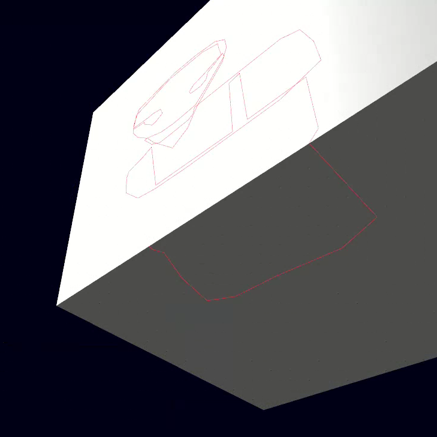
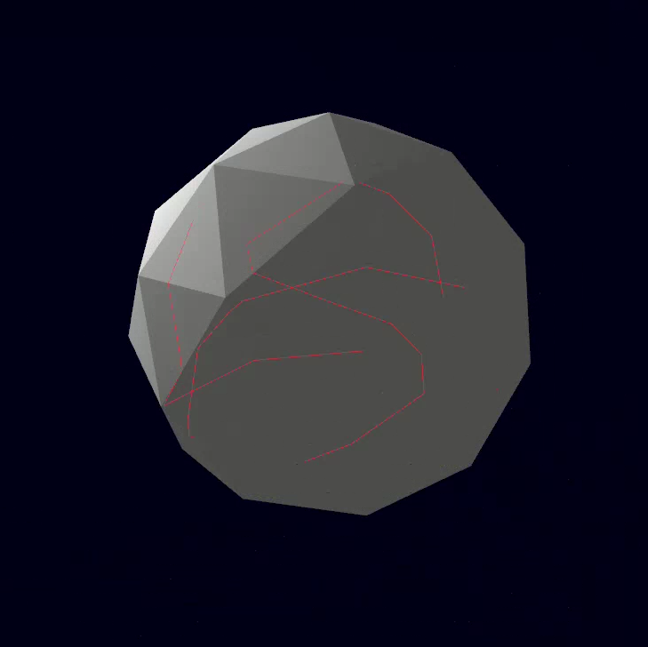
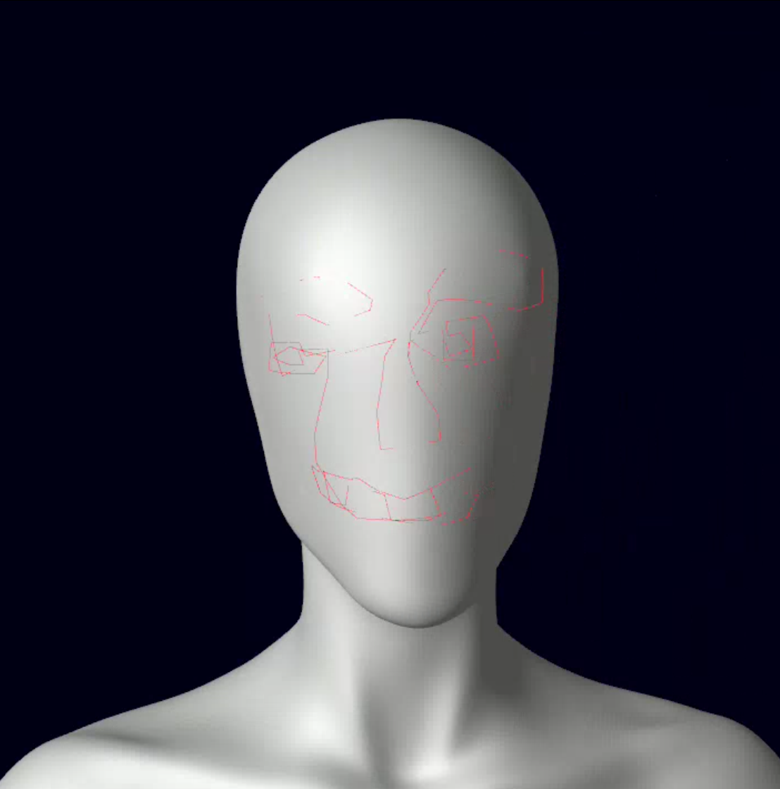

# Grease Pencil OpenGL App for plain objects

Implementing a Greese Pencil functionality for drawing 2D shapes over 3D meshes

This is for a downstream project + a nice learning experience.

Current State:
1. Working Tri-Mesh -> BVH builder (CPU implementation for triangle picking)
2. On Mouse-Click:
    - Ray-BVH (node) traversal for grouping intersecting triangles
    - Ray-Triangle intersection for picking triangles to connect
    - Greedy surface-walking algorithm for connecting sequential points clicks along the surface of a mesh

Current Work:
- A CPU-BVH implementation with a depth-ordered equal split strategy
- A Ray-AABB debugging visualization for ray-BVHnode intersection
- A Ray-AABB traversal with the SLAB method to collect intersected BVHnodes
- Moeller-Trumbore alg (glm::glx::intersect.h) for triangle picking
- Greedy triangle-walking algorithm - unfolding line seqments along a set of edge-connected triangles

Future Work:
- Optimize BVH to be fast for loading a scene (currently ~8s)
- Build Edge-Model during BVH build to simplify the triangle-walking algorithm
- (feature) Connect the lines (i.e. a loop) and resolve mesh to minimize volme between the line-surface & mesh.
- (feature) Estimate best position of N darts for mapping a 3-D surface to a 2-D shape
- (output) A high-res PNG of our pattern blocks/designs baked on some UV-wrapping rules (need to figure out)

New:
- Now uses DearImGUI for input handling inputs and visual options

